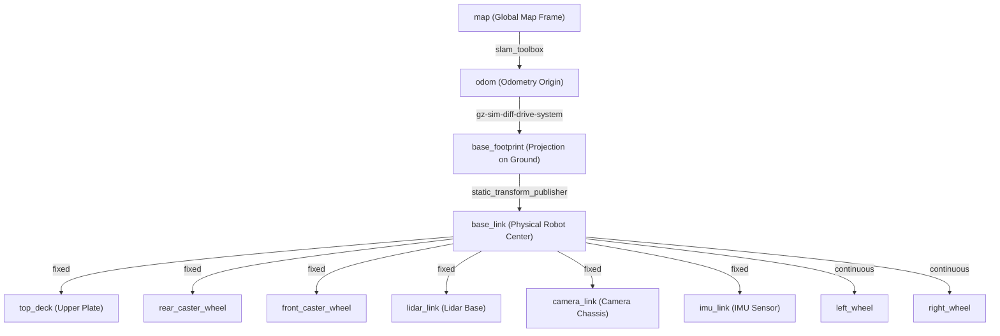
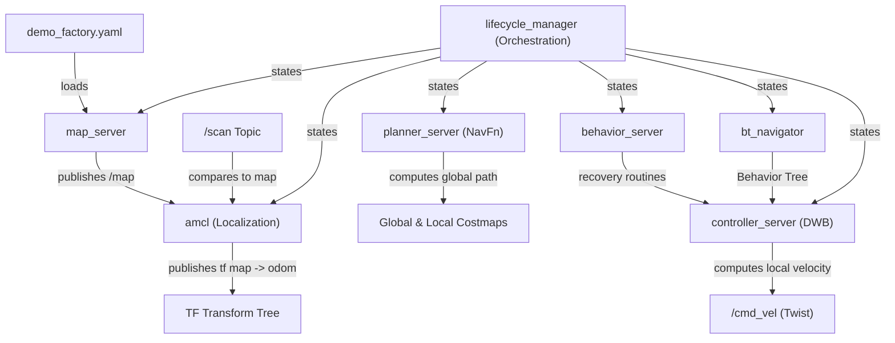

# AMR Robot - Mapping & Simulation Documentation

This document provides a comprehensive technical overview of the work done so far on the Autonomous Mobile Robot (AMR) simulation package. It details the system architecture, physical upgrades, visualization fixes, lifecycle SLAM setup, mapping procedure, and next steps for autonomous navigation.

---

## 📐 System Architecture & Coordinate Trees

Understanding the transform tree (TF) and communication flow is critical for proper localization, mapping, and path planning. Below are the structural diagrams of the AMR workspace.

### 1. TF Frame Hierarchy
The coordinate transform tree propagates coordinate frames from the global static map down to the individual physical robot components:



### 2. Node & Topic Communication Graph
This graph outlines how ROS 2 nodes interact with Gazebo Harmonic via standard bridges:

```mermaid
graph TD
    subgraph ROS 2 Environment
        TELEOP["teleop_twist_keyboard"]
        RSP["robot_state_publisher"]
        STF["static_transform_publisher"]
        SLAM["slam_toolbox (Lifecycle Sync)"]
        RVIZ["RViz2 (Visualization)"]
    end

    subgraph ROS-Gazebo Bridges
        B_CMD["/cmd_vel bridge"]
        B_ODOM["/odom bridge"]
        B_SCAN["/scan bridge"]
        B_TF["/tf bridge"]
        B_JS["/joint_states bridge"]
        B_CLOCK["/clock bridge"]
    end

    subgraph Gazebo Sim (Harmonic)
        GZ["Gazebo Simulation Engine"]
        DIFF["DiffDrive Plugin"]
        JSP["JointStatePublisher Plugin"]
    end

    %% Movement Flow
    TELEOP -->|/cmd_vel| B_CMD -->|/cmd_vel| DIFF
    
    %% Feedback / Odometry Flow
    DIFF -->|/odom| B_ODOM -->|/odom| SLAM
    DIFF -->|/tf| B_TF -->|/tf| RVIZ
    
    %% Lidar / Scan Flow
    GZ -->|/scan| B_SCAN -->|/scan| SLAM
    
    %% Joint States Flow
    JSP -->|/joint_states| B_JS -->|/joint_states| RSP
    
    %% Transforms to RViz
    RSP -->|/tf| RVIZ
    STF -->|/tf| RVIZ
    SLAM -->|/tf (map -> odom)| RVIZ
    
    %% Clock Sync
    GZ -->|/clock| B_CLOCK -->|/clock| ROS 2
```

---

## 🛠️ Enhancements & Physical Upgrades Done

We resolved several physical and rotational instabilities to prepare the robot for high-fidelity mapping:

### 1. Symmetrical Dual-Caster Balance
* **The Problem**: A single rear-caster configuration caused the robot base to slant under gravity, dragging along the factory floor, causing high drift, and introducing heavy noise into the odometry calculation.
* **The Fix**: Symmetrized the design in `urdf/amr_robot.urdf.xacro`:
  - Renamed the rear caster to `rear_caster_wheel`.
  - Added a front caster `front_caster_wheel` symmetrically at `x = +(base_l/2 - 0.04)`.
  - Configured high contact stiffness (`kp = 1000000.0`) and **zero friction** (`mu1 = 0.0`, `mu2 = 0.0`) in Gazebo.
* **Result**: The robot deck remains perfectly level under gravity, permitting fluid and drift-free movement.

### 2. Steering Axis Inversion
* **The Problem**: Active wheel rotation was inverted; driving forward via standard keyboard commands (`i`) moved the robot backward, and steering was mirrored.
* **The Fix**: Modified joint axis parameters in the wheel definitions inside the URDF:
  - Changed `<axis xyz="0 0 1"/>` to `<axis xyz="0 0 -1"/>` for both `left_wheel_joint` and `right_wheel_joint`.
* **Result**: Restored standard control mapping in the differential drive controller.

### 3. Smooth Wheel Rotation in RViz (No Jitter)
* **The Problem**: Wheel meshes in RViz jittered, lagged, and flickered during motion. This was caused by two conflicting state publishers: a static `/joint_states` publisher in the launch file and the simulated plugin publisher on the same topic, causing the state to toggle rapidly between `0.0` and actual rotation.
* **The Fix**:
  - Added `gz-sim-joint-state-publisher-system` inside the `<gazebo>` block of `amr_robot.urdf.xacro` to publish live simulated states.
  - Deleted the redundant, static `joint_state_publisher` ROS 2 node from `launch/gazebo.launch.py`.
* **Result**: Flawless, latency-free wheel spin in RViz.

### 4. Lifecycle-Managed SLAM Toolbox Activation
* **The Problem**: In ROS 2 Jazzy, `slam_toolbox` runs as a Managed Lifecycle Node. Starting it directly as a standard `Node` keeps it in an `unconfigured` state, causing it to ignore laser scan messages and fail to establish the critical `/map -> /odom` frame transform.
* **The Fix**:
  - Updated `launch/slam.launch.py` to include the official `online_sync_launch.py` script.
  - Included a lifecycle manager that automatically triggers transition events (`configure` and `activate`) on the mapping node.
* **Result**: Automatic initialization, establishing `/map -> /odom` immediately on boot.

---

## 🗺️ Mapping the Factory Floor

We have successfully mapped the factory environment using `slam_toolbox` and saved the map file!

### Step-by-Step Mapping Procedure

1. **Clean Workspace & Build**:
   ```bash
   colcon build --packages-select amr_robot
   source install/setup.bash
   ```

2. **Boot up Simulation**:
   ```bash
   ros2 launch amr_robot gazebo.launch.py
   ```
   *Spawns the AMR at the starting warehouse location `(0.0, -2.5, 0.15)`.*

3. **Launch SLAM Synchronization & RViz**:
   ```bash
   ros2 launch amr_robot slam.launch.py
   ```
   *In RViz, set the Fixed Frame to `map` to see the coordinate grid and obstacles.*

4. **Navigate using Keyboard Teleoperation**:
   ```bash
   ros2 run teleop_twist_keyboard teleop_twist_keyboard
   ```
   *Steer the robot slowly around all hallways and workspaces to build a highly dense and clean grid map.*

5. **Save the Completed Map**:
   The map is successfully saved using the correct nested `/slam_toolbox/save_map` ROS 2 service call:
   ```bash
   ros2 service call /slam_toolbox/save_map slam_toolbox/srv/SaveMap "{name: {data: '/home/mohamed-azimal/ros2_ws/src/amr_robot/maps/demo_factory'}}"
   ```
   This generated two distinct files at `/home/mohamed-azimal/ros2_ws/src/amr_robot/maps/`:
   - `demo_factory.pgm`: High-resolution 2D occupancy grid binary image.
   - `demo_factory.yaml`: Meta-configuration indicating image path, resolution, origin, threshold rates.

---

---

## 🚀 Autonomous Navigation (Nav2) Integration

We have successfully integrated the **ROS 2 Navigation Stack (Nav2)**! The AMR is now fully capable of autonomous path planning, localization, and collision avoidance on the factory floor.

### 1. Navigation Node Architecture

The navigation system consists of six coordinated lifecycle nodes managed by a centralized lifecycle manager:



* **Adaptive Monte Carlo Localization (AMCL)**: Compares the simulated Lidar range scan (`/scan`) against the static map (`demo_factory`) using a particle filter. It publishes the critical `/map -> /odom` frame transform, completing the physical transformation path.
* **Global & Local Costmaps**:
  - The **Global Costmap** maps static obstacles from the map file with an inflation layer to prevent the robot from colliding with walls.
  - The **Local Costmap** maps real-time obstacles dynamically around the robot for high-fidelity collision avoidance.
* **Planner Server (`nav2_planner`)**: Employs the `nav2_navfn_planner::NavfnPlanner` to compute the shortest, collision-free global path from the current position to the commanded target goal.
* **Controller Server (`nav2_controller`)**: Employs the `dwb_core::DWBLocalPlanner` (Dynamic Window Approach) to translate the global path into active linear (`x`) and angular (`z`) steering velocities (`/cmd_vel`), dynamically avoiding dynamic obstacles and decelerating smoothly near the target.
* **Centralized Lifecycle Manager**: Coordinates state transitions (`configure`, `activate`) across all nodes sequentially: `map_server` $\rightarrow$ `amcl` $\rightarrow$ `planner_server` $\rightarrow$ `controller_server` $\rightarrow$ `behavior_server` $\rightarrow$ `bt_navigator`.

### 2. RViz Nav2 Custom Dashboard (`rviz/nav2.rviz`)

To present a premium, professional portfolio-grade display, we copied and adapted the official Nav2 RViz visualization dashboard and packaged it directly within the codebase:
- **Global & Local Costmap Overlays**: Visually represents occupied regions, free space, and safety inflation boundaries.
- **Particle Cloud (`/particle_cloud`)**: Displays the Monte Carlo particle filter density surrounding the robot, showing how localization confidence converges.
- **Path Visualizers**: Renders the planned global path (green line) and the local trajectory predictions (blue line).
- **Interactive Navigation Tools**: Incorporates pre-configured buttons for **2D Pose Estimate** and **Nav2 Goal** to control navigation directly.

---

## 🚦 Running Autonomous Navigation

Follow these step-by-step developer commands to demonstrate or learn Nav2 features:

### Step 1: Boot the Gazebo Simulator
Launch Gazebo in the factory environment. This spawns the robot and initializes the simulated clock (`/clock`):
```bash
# Source and launch Gazebo simulation
source install/setup.bash
ros2 launch amr_robot gazebo.launch.py
```

### Step 2: Launch the Navigation Stack & RViz Dashboard
In a new terminal, launch the Nav2 suite. This automatically loads our pre-saved `demo_factory` map, launches the lifecycle managers, and opens the pre-configured RViz dashboard:
```bash
# Source and launch Nav2
source install/setup.bash
ros2 launch amr_robot navigation.launch.py
```

### Step 3: Pose Initialization & Waypoint Dispatch
1. **Initialize the Robot Pose**: 
   - Click the **2D Pose Estimate** button at the top of RViz.
   - Click and drag on the map at the robot's approximate position in the warehouse to match its spawn coordinate.
   - Watch the particle array `/particle_cloud` converge tightly around the robot base.
2. **Autonomous Navigation**:
   - Click the **Nav2 Goal** (or **2D Goal Pose**) button at the top of RViz.
   - Click and drag anywhere on the map to set a target goal and orientation.
   - **Watch the Magic**: The planner computes the path, the controller steers the wheels smoothly, dynamic costmaps update, and the AMR drives cleanly to its destination!

