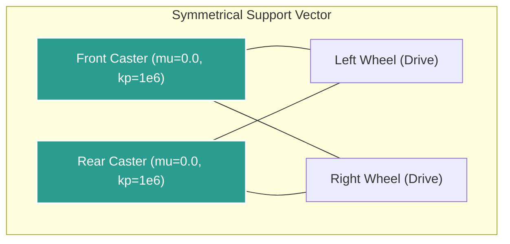
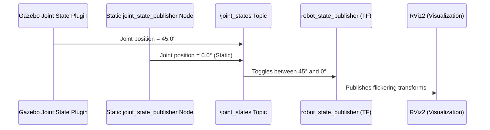
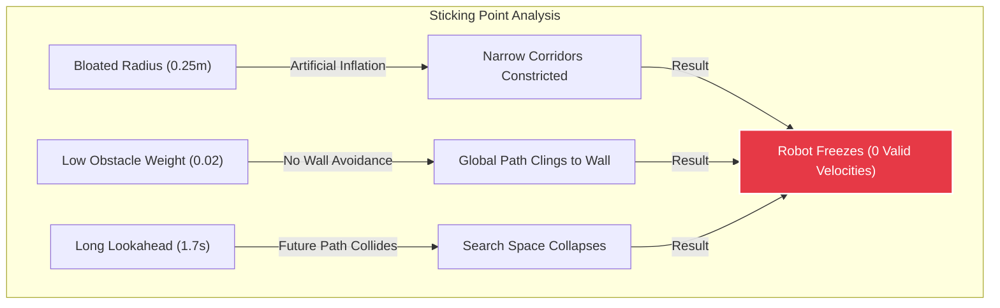

# AMR Robot - Troubleshooting & Parameter Tuning Journal

This engineering journal documents the technical challenges faced, diagnostic steps, root causes, and systemic solutions applied during the physical modeling, simulation bridges, SLAM mapping, and Nav2 autonomous navigation integration for our 2WD differential drive Autonomous Mobile Robot (AMR).

---

## 🔍 Overview of All System Challenges

During the design, build, and validation phases of our robot simulation in **ROS 2 Jazzy** and **Gazebo Harmonic**, we resolved nine distinct technical bottlenecks. These ranged from base physical dynamics to complex control and local planning parameter calibrations.

### Diagnostic Matrix

| Class | Component | Symptom | Core Root Cause | Technical Solution |
| :--- | :--- | :--- | :--- | :--- |
| **Physical & Kinematics** | **URDF** | Robot deck slants forward/backward, introducing severe odometry drift. | Single rear caster creates an unstable pivot under gravity. | Symmetrized base with dual front/rear caster wheels; set `mu = 0.0` and `kp = 1e6`. |
| **Physical & Kinematics** | **URDF** | Teleoperation commands steer the robot backward/inverted. | Left/right wheel rotational joint axes inverted (`0 0 1` vs `0 0 -1`). | Changed wheel joint axis to `<axis xyz="0 0 -1"/>` to match positive rotation. |
| **Simulation Bridges** | **Joint State** | Robot wheels jitter, lag, and flicker visually in RViz. | Conflict on `/joint_states` topic between static publisher and live Gazebo plugin. | Removed the static `joint_state_publisher` node and bridged Gazebo joints. |
| **Simulation Bridges** | **SLAM** | Mapping node boots but ignores laserscan data and fails to establish `/map` frame. | `slam_toolbox` runs as a Managed Lifecycle node, booting into an `unconfigured` state. | Integrated `online_sync_launch.py` with an active lifecycle manager node. |
| **Simulation Bridges** | **Colcon Build** | Workspace build fails with `PermissionError` when writing to `/home/install`. | Relative build-base flags (`../../build`) resolved paths relative to the host home root. | Run standard `colcon build` without relative output flags from `~/ros2_ws`. |
| **Localization & Nav2** | **AMCL** | Localization node crashes on startup with a KD-tree assertion error. | Particle filter cloud uninitialized due to `set_initial_pose` default setting of `false`. | Set `set_initial_pose: true` and configured explicit initial coordinates in YAML. |
| **Localization & Nav2** | **Nav2 Planner** | Goals aborted immediately with `INVALID_PLANNER (201)` error. | BT Navigator requested global path from standard plugin `GridBased`, but custom was `GridPlanner`. | Renamed planner configuration block and plugin identifier to `GridBased`. |
| **Localization & Nav2** | **Nav2 Controller** | Robot decelerates and freezes permanently near walls and obstacles. | Trajectory search space collapsed to zero valid velocity candidates. | Reduced modeled radius, boosted obstacle critic scale, and shortened lookahead. |
| **Localization & Nav2** | **Nav2 Costmap** | Robot clips walls on turns or struggles to find center paths. | Rigid costmap threshold scaling and narrow inflation margins. | Decreased `cost_scaling_factor` to `5.0` and expanded global inflation to `0.65m`. |

---

## 🛠️ Physical & Kinematic Calibrations

### 1. Symmetrical Dual-Caster Balance
* **The Problem**: Our 2WD differential drive chassis originally featured a single rear caster wheel. In simulated environments, this created a single tipping pivot point. Under gravity, the robot tilted, scraping the deck floor, causing extreme wheel slippage, and injecting high noise levels into the odometry calculation.
* **The Root Cause**: A single caster is highly sensitive to the center of mass. Without active lateral stabilization, minor torque inputs on the main wheels forced the chassis to pitch and roll, causing non-planar contact.
* **The Solution**: Symmetrized the design in [amr_robot.urdf.xacro](file:///home/mohamed-azimal/ros2_ws/src/amr_robot/urdf/amr_robot.urdf.xacro) by introducing two caster wheels placed at equal distances from the robot's physical center:
  * **Rear Caster**: Symmetrically positioned at $x = -(\text{base\_l}/2 - 0.04)$.
  * **Front Caster**: Added symmetrically at $x = +(\text{base\_l}/2 - 0.04)$.
  * **Gazebo Contact Physics**: To prevent caster wheels from resisting steer rotation, we set friction coefficients to zero and contact stiffness to maximum:
    ```xml
    <gazebo reference="front_caster_wheel">
      <mu1 value="0.0"/>
      <mu2 value="0.0"/>
      <kp value="1000000.0"/>
      <kd value="1.0"/>
    </gazebo>
    ```



---

### 2. Steering Axis Inversion
* **The Problem**: Keyboard teleoperation commands (e.g. driving forward `i`) moved the robot backward, and left/right angular rotations were inverted.
* **The Root Cause**: The URDF wheel joints used a positive rotational axis of `0 0 1`. However, the differential-drive system plugin uses standard right-hand-rule coordinates. When torque was applied to rotate wheels in a positive direction, the physical base rolled backward because the joint coordinates did not match the controller's kinematic model.
* **The Solution**: Corrected the wheel joint definition axis inside the URDF to positive outward vectors:
  ```xml
  <!-- Modified in Left and Right Wheel Joint tags -->
  <axis xyz="0 0 -1"/>
  ```
  This aligned the wheel rotation with the coordinate systems expected by the `gz-sim-diff-drive-system` plugin.

---

## 📡 Simulation Bridges & Lifecycle Sync

### 3. Redundant Joint State Publisher & Wheel Visual Jitter
* **The Problem**: When the robot was in motion, the wheel meshes in RViz flickered, lagged, and vibrated back and forth between rotated states and `0.0` degrees.
* **The Root Cause**: Two nodes were publishing transforms for wheel joints on the `/joint_states` topic simultaneously:
  1. The simulated Gazebo plugin (`gz-sim-joint-state-publisher-system`) publishing live wheel rotation coordinates.
  2. A static `joint_state_publisher` launched in `gazebo.launch.py` broadcasting fixed state positions.
  
  This created a race condition. The wheel transformation rapidly toggled between the live rotated state and the static zero state, causing severe visual jitter.



* **The Solution**: 
  1. Deleted the redundant static `joint_state_publisher` node from [gazebo.launch.py](file:///home/mohamed-azimal/ros2_ws/src/amr_robot/launch/gazebo.launch.py).
  2. Confirmed that only the Gazebo Joint State Publisher system handles wheel state generation:
     ```xml
     <plugin filename="gz-sim-joint-state-publisher-system" name="gz::sim::systems::JointStatePublisher">
       <topic>joint_states</topic>
     </plugin>
     ```

---

### 4. Lifecycle-Managed SLAM Toolbox Activation
* **The Problem**: Launching the `slam_toolbox` node on ROS 2 Jazzy did not output mapping information. The `/map` topic remained empty, and the critical global map coordinate frame transform `/map -> /odom` was never broadcast.
* **The Root Cause**: In modern ROS 2 distributions (such as Jazzy), `slam_toolbox` is implemented as a **Managed Lifecycle Node**. When started directly as a standard ROS node, it sits in an `unconfigured` state. It will not subscribe to `/scan` or publish transforms until it transitions to `active`.
* **The Solution**: Updated [slam.launch.py](file:///home/mohamed-azimal/ros2_ws/src/amr_robot/launch/slam.launch.py) to run the node through a lifecycle orchestration framework:
  1. Loaded the package's pre-configured lifecycle settings.
  2. Replaced the basic node declaration with the official `online_sync_launch.py` script.
  3. Included a dedicated `lifecycle_manager` node configured to automatically send state change triggers (`configure` and `activate`) to `slam_toolbox` on boot.

---

### 5. Workspace Build Path Resolution Permissions
* **The Problem**: Executing a package-specific compilation from the workspace directory resulted in permission failures:
  ```bash
  PermissionError: [Errno 13] Permission denied: '/home/install/local_setup.ps1'
  ```
* **The Root Cause**: The compile command used relative pathing overrides:
  ```bash
  colcon build --packages-select amr_robot --build-base ../../build --install-base ../../install
  ```
  Since the terminal working directory was the workspace root `~/ros2_ws` (located at `/home/mohamed-azimal/ros2_ws`), the path `../../` resolved directly to `/home/`. A standard user account does not have write access to `/home/`, triggering a OS permission denial.
* **The Solution**: Omit custom relative base flags. Run the standard colcon compiler from the workspace root:
  ```bash
  colcon build --packages-select amr_robot
  ```
  Colcon automatically resolves, builds, and outputs package resources locally under `~/ros2_ws/build` and `~/ros2_ws/install`.

---

## 🧭 Localization & Nav2 Controller Tuning

### 6. AMCL Particle Filter Initialization Crash
* **The Problem**: Booting Nav2 caused the localization node `amcl` to crash instantly, outputting the following assertion error:
  ```
  amcl: ./src/pf/pf_kdtree.c:363: pf_kdtree_cluster: Assertion `node == pf_kdtree_find_node(self, self->root, node->key)' failed.
  ```
* **The Root Cause**: Adaptive Monte Carlo Localization relies on a spatial KD-Tree to cluster particles. The `set_initial_pose` parameter was missing from our configuration and defaulted to `false`. Without a valid seed pose, AMCL attempted to populate the KD-Tree with uninitialized arrays containing garbage memory values or `NaN`s, causing the tree structure assertion to fail.
* **The Solution**: Configured AMCL to force-load starting coordinates upon initialization:
  ```yaml
  amcl:
    ros__parameters:
      set_initial_pose: true
      initial_pose:
        x: 0.0
        y: -2.5
        z: 0.0
        yaw: 1.5708
  ```

---

### 7. Global Planner Plugin Mismatch
* **The Problem**: Sending navigation goals via RViz resulted in immediate failures. The BT Navigator aborted the action, logging an invalid planner error:
  ```
  [planner_server]: GridBased plugin failed to plan: "Planner id GridBased is invalid"
  [bt_navigator]: Action NavigateToPose failed with error code 201 (INVALID_PLANNER)
  ```
* **The Root Cause**: The ROS 2 Jazzy default Navigation Behavior Trees (`navigate_to_pose_w_replanning_and_recovery.xml`) reference the global path planner plugin using the standard system name **`GridBased`**. However, in [nav2_params.yaml](file:///home/mohamed-azimal/ros2_ws/src/amr_robot/config/nav2_params.yaml), the planner was declared under the custom tag `GridPlanner`. When the behavior tree requested a path from `GridBased`, the server found no matching plugin.
* **The Solution**: Updated the planner server config to map the expected Behavior Tree tag:
  ```yaml
  planner_server:
    ros__parameters:
      planner_plugins: ["GridBased"]
      GridBased:
        plugin: "nav2_navfn_planner::NavfnPlanner"
  ```

---

### 8. DWB Local Controller Obstacle Freezing & Sticking
* **The Problem**: When navigating near walls, pillars, or narrow corridors, the AMR slowed down to a crawl and froze permanently, returning `0 valid trajectories` and failing the goal.



* **The Root Cause**: This freezing behavior represents a complete **search space collapse** inside the DWB local planner due to three conflicting parameters:
  1. **Bloated Footprint Model**: The parameters set `robot_radius: 0.25` ($50\text{cm}$ footprint). However, our URDF base size is $0.265\text{m} \times 0.265\text{m}$.
     $$\text{Physical diagonal radius (circumradius)}: r = \sqrt{0.1325^2 + 0.1325^2} \approx 0.187\text{m}$$
     By setting `robot_radius` to `0.25`, the costmaps inflated the footprint of every obstacle by an extra $6.3\text{cm}$ of ghost spacing, blocking navigable paths.
  2. **Imbalanced Critic Scales**: The cost-scoring weight `ObstacleFootprint.scale` was set to a tiny `0.02`, while the path-following critics (`PathAlign`, `PathDist`) were set to `32.0`. The robot prioritized sticking perfectly to the global path over keeping its distance from obstacle inflation zones. Once the path led close to a wall, the bloated $25\text{cm}$ modeled footprint intersected the lethal boundary.
  3. **High Projection Horizon**: `sim_time: 1.7` forced DWB to project trajectories $1.7\text{s}$ into the future. In narrow corridors, projecting a velocity vector this far forward guarantees a collision with the wall, disqualifying all candidate trajectories.

* **The Solution**: Optimized the local planning search parameters to balance safety with path execution:
  * **Footprint Recalibration**: Reduced `robot_radius` to **`0.20`**. This accommodates our physical circumradius ($0.187\text{m}$) plus a highly safe $1.3\text{cm}$ structural buffer.
  * **Dynamic Critic Weighting**: Raised `ObstacleFootprint.scale` to **`1.5`** to make DWB actively steer the robot away from obstacle boundaries:
    ```yaml
    FollowPath:
      critics: ["ObstacleFootprint", "PathAlign", "GoalAlign", "PathDist", "GoalDist"]
      ObstacleFootprint.scale: 1.5
      PathAlign.scale: 32.0
      GoalAlign.scale: 24.0
    ```
  * **Reduced Prediction Horizon**: Shortened the velocity simulation time `sim_time` from `1.7` to **`1.3`** seconds, allowing the local planner to execute tight, reactive maneuvers in confined spaces.

---

### 9. Inflation Radius & Cost Scaling Factor Calibration
* **The Problem**: The robot steered erratically in open areas or struggled to align dynamically when navigating tight turns.
* **The Root Cause**: The global and local inflation boundaries decayed too sharply due to a high cost scaling factor (`10.0`), creating sharp boundaries between zero-cost regions and lethal obstacle zones.
* **The Solution**: Softened the inflation gradients:
  * **Slower Cost Decay**: Decreased `cost_scaling_factor` in both costmaps to **`5.0`**. This slows down the decay rate of cost values around obstacles, providing a smoother cost gradient.
  * **Centering Trajectories**: Expanded global `inflation_radius` to **`0.65`** to push the global path calculation to stay centered in corridors:
    ```yaml
    # Global Costmap
    inflation_layer:
      inflation_radius: 0.65
      cost_scaling_factor: 5.0

    # Local Costmap
    inflation_layer:
      inflation_radius: 0.55
      cost_scaling_factor: 5.0
    ```

---

## 💡 Key Engineering Takeaways & Best Practices

1. **Model Footprints Accurately**: Always compute the exact circumradius of your URDF chassis model. Artificially high safety buffers will constrict costmap space, leading to local path planning failures.
2. **Harmonize Behavior Trees and Plugins**: When utilizing default Nav2 behavior trees, ensure that your custom plugin identifiers inside `nav2_params.yaml` match the plugin tags expected by the BT XML schemas (e.g. `GridBased` for planners).
3. **Audit Lifecycle States**: In modern ROS 2, if a node handles SLAM or localization but outputs nothing, check its lifecycle state using the command line:
   ```bash
   ros2 lifecycle get /node_name
   ```
   Ensure a lifecycle manager node is active to transition nodes from `unconfigured` to `active`.
4. **Tune Local Planner Critics Iteratively**: The DWB local planner relies on a delicate balance of critic weights. Never let path-following weights completely overpower obstacle avoidance.
5. **Manage Stdin/Stdout Buffering in Launch**: In custom ROS 2 Python launch scripts, always use standard stdout buffering environment overrides to prevent logs from interleaving or freezing in the terminal output stream.


pkill -f gz
pkill -f slam_toolbox
pkill -f rviz2
pkill -f teleop
sleep 3


# Terminal 1
ros2 launch amr_robot gazebo.launch.py world:=opil_factory
# Terminal 2
ros2 launch amr_robot navigation.launch.py map:=opil_factory
# → Do 2D Pose Estimate in RViz to align laser scan with map
# Terminal 3
ros2 launch amr_robot mission_nodes.launch.py
# → It will print the computed map waypoints in the terminal logs


cd ~/ros2_ws && colcon build --packages-select amr_robot
