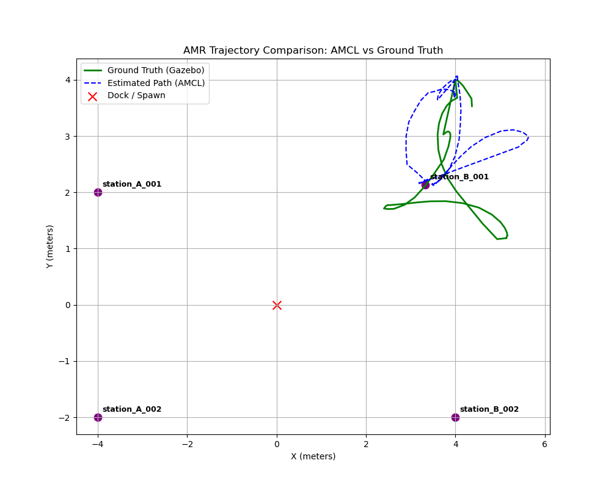

# AMR Mission Performance Evaluation Report

**Date/Time (UTC):** 2026-06-13 14:07:23

## 1. Executive Summary
- **Scan Success Rate:** 0.0% (0/4 stations scanned successfully)
- **Mean Localization Drift:** 105.23 cm
- **Max Localization Drift:** 218.56 cm
- **Final Docking Drift:** 63.49 cm

## 2. Localization Drift Performance
The localization accuracy is evaluated by comparing the AMR's estimated pose from AMCL against the Gazebo Ground Truth sensor telemetry.

| Metric | Value |
| --- | --- |
| Mean Drift | 105.23 cm |
| Maximum Drift | 218.56 cm |
| Final Dock Drift | 63.49 cm |

## 3. Inventory Station Scan Log
| Station ID | Detected QR Content | Status | Timestamp |
| --- | --- | --- | --- |
| station_A_001 |  | TIMEOUT | 2026-06-13T14:02:16.520765 |
| station_A_002 |  | TIMEOUT | 2026-06-13T14:02:16.564184 |
| station_B_002 |  | TIMEOUT | 2026-06-13T14:02:16.609840 |
| station_B_001 |  | TIMEOUT | 2026-06-13T14:04:17.089780 |
| station_B_001 |  | TIMEOUT | 2026-06-13T14:06:32.207012 |

## 4. Trajectory Visualization
Below is the graphical plot displaying the comparison between estimated (AMCL) and ground-truth trajectories:

